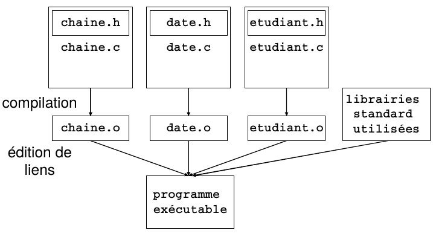

#  Elaborer un programme
<!-- .slide: class="page-title" -->


## Sommaire
<!-- .slide: class="toc" -->

 *Elaborer un programme*

- Dompter les makefiles et savoir organiser votre programme en plusieurs fichiers.
- Le précompilateur : inclusion, la compilation conditionnelle, les macros, ...
- Utilisation des fonctions : les callbacks, les récursives, les inlines, ...
- Les types avancés : énumérations, typedefs, structures, unions.
- Créer des bibliothèques statiques, partagées et dynamiques.


## Les Makefiles

- Les lignes de commande gcc, C bon pour les petits programme
- un fichier Makefile dans lequel va décrire  :
    + l’association des différents modules du projet,
    + leur compilation,
    + leur édition de liens et les bibliothèques.

- /!\ L’écriture correcte d’un tel module peut devenir très complexe


## Un fichier Makefile permet:
- d’assurer une compilation séparée à l’aide d’un compilateur C choisi;
- de ne recompiler que le code modifié depuis la dernière compilation;
- Contient les instructions indiquant à la commande make comment exécuter les instructions nécessaires à la création du fichier exécutable.

```makefile
    cible:  dependance
            commandes
```

- cible: nom du fichier généré par les commandes qui suivent, ou action générée par ces commandes
    + Si la cible est un fichier, la cible n’est construite que si ce fichier est plus récent que la cible

- dependances: fichiers ou règles nécessaires à la création de la cible
- commandes: suite de commandes du shell exécutées
- pour créer la cible:
    + les commandes sont toujours précédées d’une tabulation
    + utiliser \ à la fin de la ligne si les commandes dépassent d'une ligne


## fichier Makefile
<br>
```makefile
    all: chaine.o etudiant.c
         gcc –o gestetud chaine.o etudiant.c
    chaine.o: chaine.c chaine.h
              gcc –c chaine.c
```
> make all
> make
> make chaine.o

-  Déclaration de macro-commande:
    NOM = VALEUR
- Appel de macro-commande:
    $(NOM)
- Utilisation possible de « jockers », ex.:
    fichier?.c


## fichier Makefile plus complet
<br>
```makefile
    BIN = gestetud
    OBJECTS = etudiant.o chaine.o
    CC = gcc
    all: $(OBJECTS)
        $(CC) $(OBJECTS) –o $(BIN)
    chaine.o:   chaine.c chaine.h
                $(CC) –c chaine.c
    etudiant.o: etudiant.c etudiant.h
                $(CC) –c etudiant.c
    clean: rm –f *.o $(BIN)
```


## Un exemple simple
<br>
```c
    /*! \file hellomain.c */
    #include <hellofunc.h>
    int main() {
        myPrintHello();
        return(0);
    }
```

```c
    /*! \file hellofunc.c */
    #include <stdio.h>
    #include <hellofunc.h>
    void myPrintHello(void) {
        printf("Hello makefiles!\n");
        return;
    }
```

```c
    /*! \file hellofunc.h */
    void myPrintHello(void);
```

```shell
    gcc -o hellomain.o hellomain.c hellofunc.c -I.
```


## Makefile 1
<br>
```makefile
    hellomake: hellomain.c hellofunc.c
        gcc -o hellomain.o hellomain.c hellofunc.c -I.
```


## Makefile 2
<br>
```makefile
    CC=gcc
    CFLAGS=-I.
    DEPS = hellomake.h
    OBJ = hellomake.o hellofunc.o

    %.o: %.c $(DEPS)
            $(CC) -c -o $@ $< $(CFLAGS)

    hellomake: $(OBJ)
            gcc -o $@ $^ $(CFLAGS)
```


##  Le préprocesseur C

1. Lorsque vous compilez un programme C, c’est le préprocesseur qui (comme son nom le laisse deviner) va s’attaquer en premier à votre fichier source.

2. Le préprocesseur est directement concerné par les directives qui figurent dans vos modules source.

3. Il les décode et c’est le résultat de ce traitement qui va être soumis au compilateur.

4. Nous allons commencer par examiner les directives traitées par le préprocesseur. Elles commencent toutes par le caractère dièse (#).


## La directive #define

- Cette directive sert à deux fins : définir des constantes symboliques et créer des macros.
```c
    #define MAX 1000
    x = y * MAX;
    z = MAX     + 12;
```

```c
    #define MOITIE(valeur) ((valeur)/2)
    resultat = MOITIE(10);
```


## Les directives de compilation conditionnelle 1/2 : Les directives  #if , #elif, #else et #endif

- Cette expression signifie que certains blocs de programme ne seront compilés que si une certaine condition est remplie.

- La structure d’un bloc #if est la suivante :

```c
    #if condition_l
        /* Bloc d’instructions 1 */
    #elif condition_2
        /* Bloc d’instructions 2 */
    #else
        /* Bloc d’instructions par défaut */
    #endif
```


## Les directives de compilation conditionnelle 2/2 : #ifdef, #ifndef
- Ces deux instructions sont équivalentes à #if defined et à #if ! defined.
- Utiliser pour éviter plusieurs inclusions d’un fichier d’en-tête


```c
    /* prog.hprog.h - Fichier d’en-tête comportant un test destiné à empêcher plusieurs inclusions */
    #ifndef PROG_H
        /* le fichier n’a pas encore été inclus */
    #define PROG_H
        /* Informations du fichier d’en-tête */
        #include ...
        #define ...
        int fn (int a );
    #endif /* fin de prog.h */
```
- Analyse :
    + si PROG H est défini. on ne fait rien du tout. Si PROG H ne l’est pas, alors on le définit et on "exécute" le contenu du fichier d’en-tête.


## La directive #undef
- De même qu’on peut définir un nom à l’aide d’une directive #define, on peut annuler cette définition par une directive #undef. En voici un exemple :
```c
    #define DEBUG 1
    /* Dans cette section du programme, toutes les occurrences de DEBUG seront remplacées par 1 et l’expression defined(DEBUG) vaudra VRAI. */
    #undef DEBUG
    /* Dans cette section du programme, toutes les occurrences de DEBUG seront remplacées par 0 et l’expression defined(DEBUG) vaudra FAUX. */
```


## Macros prédéfinies  DATE , TIME , LINE et FILE .

<br>
```c
    printf("Programme %s : Fichier non trouvé ligne %d\n", __FILE__, __LINE__);
```

> Programme toto.c : Fichier non trouvé à la ligne 32.


##  Les pragmas


*Les "pragma" est une directive preprocesseur*
- La directive #pragma fournit un moyen de demander un comportement particulier du compilateur.
- Cette directive est le plus particulièrement utile pour tirer parti des capacités d'un compilateur particulier.

*#pragma est différent selon le compilateur.*

```c
    // ne pas optimisé cette partie du code
    #pragma GCC push_options
    #pragma GCC optimize ("O0")
        //your code
    #pragma GCC pop_options
```


> https://gcc.gnu.org/onlinedocs/gcc/Pragmas.html
> Notez que, en général, nous ne recommandons pas l'utilisation de pragmas;
> cf. \__attributes\__

- déclarer une fonction comme dépréciée :
```c
    int old_fn () __attribute__ ((deprecated));
```


##  Les arguments de la ligne de commande : argc argv

- argc, est un entier indiquant le nombre des arguments qui ont été écrits à la suite de l’invite du système d’exploitation, y compris le nom du programme lui-même.
- argv[0] pointe sur le nom du programme, argv[1], sur le premier argument, et ainsi de suite.

*Les noms argc et argv ne sont pas des mots réservés, mais l’usage — très généralement respecté — veut qu’on appelle ainsi les deux arguments de main().*

```c
    int main(int argc, char *argv[]);
    // ou :
    int main(int argc, char **argv);
```

- Les arguments sont séparés les uns des autres sur la ligne de commande par des espaces.
    + Si un des arguments que vous voulez passer est une chaîne de caractères contenant un ou plusieurs blancs, vous devez la placer entre guillemets.


##  La notion de blocs et la portée des identificateurs

- Les fonctions en C sont définies à l'aide de blocs d'instructions.
- Un bloc est définie une paire d'accolades et se décompose en deux parties:
- Tous les blocs d'instructions permettent de définir des variables locales
    + les blocs de fonction,
    + les blocs d'instructions if, while ou for.

```c
    //Blocs d'instructions en C
    {
        int hh=0;            //<déclarations locales>
        printf ("%d\n", hh); //<instructions>
    }

    if (N>0)
    {
        // ici hh n'est pas défini
        int ii=0;// Si la condition (N>0) n'est pas remplie, ii n'est pas défini.
        for (ii=0; I<N; ii++) {//...}
    }
    // A la fin du bloc conditionnel, ii disparaît.
```


## Utilisation des fonctions : les callbacks, les statics, les récursives, les inlines, ...

*Généralités sur les fonctions*

- Les fonctions permettent:
    + de scinder un programme en plusieurs parties, et de décrire le déroulement du programme principal de façon claire
    + de mettre en commun des ressources entre programmeurs
    + d’éviter des séquences d’instructions répétitives
    + de spécialiser des séquences d’instructions grâce à leurs paramètres
    + de calculer des valeurs, et/ou d’agir sur des objets


## Particularités des fonctions en C
- Types de modules: les « fonctions » et « procédures » ne sont pas distinguées.
- Mode de transmission des arguments: uniquement par valeur.
- Variables globales: accessibles à toutes les fonctions.


## Types de modules
- Les fonctions fournissent un résultat (valeur de retour), calculé à partir des valeurs de ses paramètres, qui peut ensuite apparaître dans une expression.
- Typiquement, les procédures des autres langages réalisent des actions, mais en pratique rien n’empêche les fonctions d’en réaliser également.
- En C, il n’existe que la notion de fonction:
    + la valeur de retour d’une fonction peut être ignorée (ex: printf)
    + une fonction peut ne retourner aucune valeur
    + une fonction peut retourner une valeur non scalaire (ex: structures)
    + une fonction peut modifier (indirectement) les valeurs de certains paramètres


## Transmission des paramètres
- En C, la transmission des paramètres se fait uniquement par valeur:
    + Les valeurs des paramètres passés lors de l’appel d’une fonction sont copiées localement à la fonction, et les copies sont ensuite utilisées en lecture/écriture.
    + Toute modification des valeurs est perdue lorsque la fonction se termine.
- Il est néanmoins possible de modifier les paramètres d’une fonction grâce à la notion de pointeur (variable pointant en mémoire vers un objet d’un certain type):
    + La fonction peut alors opérer en lecture/écriture sur l’objet pointé par pointeur.
    + Les modifications sont alors effectuées sur l’objet d’origine, et restent donc effectives après la fin de la fonction.


## Définition d’une fonction

<br>
```c
    /* définition d’une fonction « max » retournant un entier et prenant deux entiers comme paramètres */


    /* entête de la fonction */
    int abs(int a, int b) {
    /* corps de la fonction */
        if (a > b)
            return (a - b);

        return (b - a);
    }
```


## Paramètres d’une fonction
- Tout type d’objet peut être passé comme paramètre d’une fonction:
    + types de base (variantes de int, float, double, char)
    + structures
    + tableaux
    + pointeurs
- Les déclarations des paramètres (séparées par des virgules dans la nouvelle norme) associent un spécificateur de type à un déclarateur (nom de variable).
- Typiquement, la classe d’allocation des paramètres d’une fonction est automatique (mot-clé auto, optionnel). Il est également possible de préciser la classe d’allocation registre (mot-clé register)
- Un liste de paramètres vide est possible (alternativement, le mot-clé void peut être utilisé)


## Valeur de retour d’une fonction
- Le résultat d’une fonction est transmis à la fonction appelante par recopie de sa valeur (mot-clé return).
- Tous les types (hormis les tableaux et les fonctions) peuvent être retournés par une fonction.
- La valeur de retour d’une fonction est une expression pour le contexte appelant.


*Cas particulier: si une fonction retourne un pointeur vers un objet local à la fonction (de classe d’allocation automatique), alors le pointeur est bel et bien retourné mais son utilisation est dangereuse.*


## Classe de mémorisation d’une fonction
- La classe de mémorisation d’une fonction définit sa visibilité pour le reste du programme:
    + La classe externe (mot-clé extern ou absence de mot-clé) rend la fonction visible (donc utilisable) depuis d’autres fichiers sources
```c
    extern int abs(int a, int b)
    int abs (int a, int b)
```
    + La classe statique (mot-clé static) cache la fonction aux autres fichiers sources et la rend donc privée au fichier auquel elle appartient
```c
    static int fonctionPrivee()
```
*Utile lorsque la fonction n’a d’usage direct que pour les autres fonctions de son fichier source. Permet l’utilisation d’un même identificateur de fonction dans plusieurs fichiers pour des utilisations particulières.*


## L’instruction return

- Instruction de rupture de séquence:
    + évaluation de expression si elle est présente
    + conversion dans le type de retour de la fonction si nécessaire
    + retour à la fonction appelante
- Nombre d’occurrences dans une même fonction:
    + plusieurs instructions return sont possibles
    + l’absence d’instruction return provoque un retour à la fonction appelante à la fin du bloc d’instructions de la fonction


*Une fonction qui retourne une valeur doit nécessairement contenir au moins une instruction return.*


## Conversion dans le type de retour
- Comme pour l’affectation, l’instruction return peut opérer des conversions implicites (éventuellement dégradantes) pour retourner une valeur du type de la fonction

```c
    int fonction() {
        int entier;
        float flottant;
        /* … */
        return flottant; /* conversion de flottant en valeur entière */
        /*… */
        return (flottant - 3); /* calcul de l’expression puis conversion en valeur entière */
    }
```


## Déclaration d’une fonction
- La déclaration d’une fonction est nécessaire pour que le compilateur puisse ensuite gérer les appels qui lui sont faits.
- La définition de fonction vaut déclaration (donc la redéclaration est permise), mais il est en général conseillé d’avoir:
    + les déclarations de fonctions dans les fichiers entêtes (.h)
    + les définitions de fonctions dans les fichiers sources (.c)
- La portée d’une déclaration de fonction:
    + est locale à un bloc d’instructions si elle est faite dans ce bloc
    + sinon est valable pour toute la partie du fichier source qui suit la déclaration


## Exemples de portée des déclarations de fonctions (1/3)

<br>
```c
    /* déclaration de maFonction à un niveau global */
    int maFonction(int val);

    int main() {
        /* maFonction est accessible ici */
    }

    void autreFonction() {
        /* maFonction est accessible ici */
    }
```


## Exemples de portée des déclarations de fonctions (2/3)

<br>
```c
    int main() {
        /* maFonction n’est pas connue ici */
    }

    /* déclaration de maFonction à un niveau global */
    int maFonction(int val);

    void autreFonction() {
        /* maFonction est accessible ici */
    }
```


## Exemples de portée des déclarations de fonctions (3/3)

<br>
```c
    int main() {
        /* déclaration de maFonction à un niveau local */
        int maFonction(int val);
        /* maFonction est accessible ici */
    }

    void autreFonction() {
        /* maFonction n’est pas connue ici */
    }
```


## Prototype de fonction
- Il est recommandé de déclarer une fonction sous forme de prototype qui spécifie:
    + le type de la valeur de retour
    + le nom de la fonction
    + le type des paramètres de la fonction
- Il s’agit de la forme recommandée de l’entête, sans l’instruction composée qui suit l’entête mais avec un point virgule
    int maFonction(int par1, float par2);


*Les identificateurs de paramètres sont optionnels dans une déclaration. Ils sont néanmoins recommandés pour rendre les déclarations plus faciles à interpréter.*

*Une fonction ne peut avoir qu’un seul prototype complet valide en C. En C++, la surdéfinition de fonction permet de définir une fonction par son nom et le type de ses arguments.*


<!-- ## Importance de la déclaration de fonction
- La norme n’impose en fait pas la déclaration des fonctions
- Le compilateur utilise le type int comme type de retour par défaut

Cela peut mener à des calculs faux sans qu’aucune détection ne puisse être réalisée par le compilateur
```c
    /* absence de directive
    #include « math.h » */
    /* absence de la déclaration
    double sqrt(double); */
    float flottant1, flottant2;
    flottant2 = sqrt(flottant1);
```

*Pas d’erreur de compilation, mais le résultat retourné est de type int (converti en float par l’affectation)*
-->

## Appel de fonction
- Le prototype d’une fonction est utilisé pour forcer d’éventuelles conversions pour les paramètres effectifs transmis aux fonctions lors de leur appel ainsi que pour la valeur de retour
```c
    float f(float, char);
    int entier1, entier2;
    float flottant1, flottant2;
    char caractere;
    /* …*/
    /* aucune conversion nécessaire */
    flottant2 = f(flottant1, caractere);
    /* conversion de entier1 en float, et de entier2 en
    char (conversion dégrandante mais légale);
    conversion du résultat de float en int */
    entier1 = f(entier1, entier2);
```


## Passage de paramètres
- Les paramètres de fonction sont toujours passés par valeur:
    + si le paramètre est une expression, celle-ci est d’abord évaluée
    + la valeur du paramètre est si besoin convertie dans le type précisé par le prototype de la fonction
    + cette valeur est utilisée comme valeur initiale pour le paramètre « muet » (celui de la définition de la fonction)
    + toute modification du paramètre muet n’a aucune incidence sur le paramètre effectif du contexte appelant (s’il s’agissait d’une lvalue)
- Cas particuliers:
    + les tableaux ne sont pas passés par valeur (voir plus loin)
    + les structures sont effectivement passées par valeur, ce qui implique la recopie de l’ensemble des champs de la structure


## Limitations du passage des paramètres par valeur
- Cas où l’on souhaite une modification des valeurs des paramètres effectifs par la fonction
```c
    void echange(int par1, int par2. {
        int tampon = par1;
        par1 = par2;
        par2 = tampon;
    }

    int main() {
        int entier1 = 1, entier2 = 2;
        echange(entier1, entier2);
    }
```

- L’échange n’a pas eu lieu sur les paramètres effectifs, solutions possibles:
    + utiliser des pointeurs pour les objets à modifier
    + utiliser la valeur de retour de la fonction pour réaliser l’affectation d’un (seul) objet à modifier
    + utiliser des variables globales visibles depuis le corps des fonctions


## Simulation d’un passage par référence
- Un pointeur contient une valeur qui est l’adresse en mémoire d’un objet typé
- On peut donc l’utiliser pour transmettre l’adresse d’un objet à une fonction qui pourra modifier le contenu de l’objet en passant par l’adresse et le type (soit le pointeur)

```c
    void echange(int *pe1, int *pe2. {
        /* pe1 et pe2 sont des pointeurs vers int */
        /* tampon prend la valeur de l’entier pointé par pe1 */
        int tampon = *pe1;
        /* l’entier pointé par pe1 prend pour valeur celle de l’entier pointée par pe2 */
        *pe1 = *pe2;
        /* l’entier pointé par pe2 prend pour valeur celle de tampo (originellement celle de l’entier pointé par pe1 */
        *pe2 = tampon;
    }
```

*Cette solution est également applicable lorsque l’on souhaite passer de « gros » objets (des structures) en paramètres, indépendamment du fait qu’on souhaite les modifier ou non.*


<!-- ## Cas des tableaux en paramètres de fonctions
- Un tableau est toujours passé en paramètre effectif par l’adresse de son premier élément
```c
    int tab[10];
    /* identificateur de tableau */
    f(tab);
    /* adresse du premier élément du tableau */
    f(&tab[0]);
```

- Plusieurs écritures sont possibles pour le paramètre muet:
```c
    void f(int t[]); /* t est un tableau de int */
    void f(int t[10]); /* t est un tableau de 10 int, mais cette information ne peut être prise en compte par le compilateur! */
    void f(int *t); /* t est un pointeur vers un entier (en pratique, celui contenu dans la première case du tableau) */
```

- Le qualifieur const peut empêcher la modification des éléments d’un tableau passé en paramètre:
```c
    void f(const int t[]); /* les éléments de t ne sont pas modifiables à l’intérieur de la fonction */
```

*Cette notation implique que l’identificateur t, pointeur vers un entier, n’est pas non plus modifiable (la notation void f(const int*t) permet de spécifier que le contenu du tableau est constant (i.e. *(t+i)) mais pas t lui-même).*
-->

## Limitation du passage de tableau en paramètre
- La taille d’un tableau (même mentionnée dans le paramètre muet pour le tableau) n’est pas connue a priori dans le corps de la fonction
- Il est souvent indispensable de fournir la taille à utiliser comme paramètre entier (permet de représenter un sous-tableau)

```c
    int sommeTab(int tab[], int taille) {
    int somme = 0;
    while (taille > 0) somme += tab[taille - 1];
        return somme;
    }
```

- Cas particulier: les chaînes de caractères ont un élément marqueur de fin,
```c
    int tailleChaine(char chaine[]) {
        int taille = 0;
        while (chaine[taille] != ‘\0’) taille++;
            return taille;
}
```


## Cas des tableaux de tableaux en paramètres
- Si l’on considère un tableau de tableaux comme formé de lignes et de colonnes, il est nécessaire pour accéder à un élément du tableau de connaître la taille des lignes, mais pas nécessairement celle des colonnes toutes les dimensions d’un tableau de tableaux passé en paramètre d’une fonction, hormis la première, doivent être données sous forme d’expressions constantes
```c
    void effaceTableau(int tab[][10], int taille1. {
        int ligne, colonne;
        for (ligne = 0; ligne++; ligne < taille1)
            for (colonne = 0; colonne++; colonne < 10)
                tab[ligne][colonne] = 0;
    }
```


## Simuler un tableau à une seule dimension
- Les tableaux étant stockés de manière contiguë en mémoire, il est possible de considérer un tableau à 2 dimensions d1 et d2 comme un tableau à une dimension (d1*d2):
    + la transmission de l’adresse du tableau nécessite une conversion explicite
```c
    void f(int *adr, int d1, int d2);
    int tab[10][20];
    /* conversion (non dégradante) de l’adresse du tableau de int(*)[20] (pointeur vers tableau de 20 entiers) vers int* (pointeur vers entier)) */
    f((int *)tab), 10, 20);
```

    + accès à un élément du tableau par:
```c
   *(adr + i * d2. est le premier élément de la ligne i
   *(adr + i * d2 + j) est le jème élément de la ligne i
```


## Exemple de simulation d’un tableau à une seule dimension

<br>
```c
    /* fonction qui prend en entrée une matrice carrée (tableau à 2 dimensions égales), met 1 sur la diagonale et 0 dans les autres cases */

        void diagonale(int *adrMatrice, int taille) {
            int ligne, colonne;
            for (ligne = 0; ligne < taille; ligne++)
                for (colonne = 0; colonne < taille; colonne++) {
                    if (ligne == colonne)
                        *(adrMatrice + taille * ligne + colonne) = 1;
                    else
                        *(adrMatrice + taille * ligne + colonne) = 0;
                    }
        }
```

- Exemple d’appel:
```c
    int matrice[20][20];
    diagonale((int *)matrice, 20);
```


## Variables globales
- Les variables globales servent à partager des informations entre fonctions sans avoir recours au passage par paramètres.
    + déclarées dans un fichier source en dehors du corps de toute fonction
```c
    int variableGlobale;
    void main() {
        variableGlobale = 5; /* … */
    }
```
- En C, par défaut toutes les fonctions ont accès à toutes les variables globales, indépendamment du module auquel elles appartiennent
    + cela nécessite néanmoins une redéclaration des variables dans les fichiers sources où elles sont utilisées.
- Il est néanmoins possible de restreindre la visibilité d’une variable au fichier source où elle est déclarée (modification de la classe de mémorisation).


## Redéclaration de variables globales (mot-clé extern)

<br>
```c
    int variableGlobale;
    int main() {
        variableGlobale = 0;
        /* ... */
    }
    // --> source1.c
```

```c
    extern int variableGlobale;
    /* redéclaration d’une variable globale déclarée dans un autre fichier source */
    int fonction() {
        /* utilisation possible de variableGlobale */
    }
    // --> source2.c
```


## Restriction à un fichier source (mot-clé static)
- Une variable globale peut être cachée aux autres fichiers source par l’emploi du mot-clé static (affecte la classe de mémorisation de la variable):

```c
    static int variableGlobaleCachee;
    /* variableGlobaleCachee est globale dans source.c, mais elle ne pourra pas être visible depuis d’autres fichiers sources (son identificateur pourra donc être réutilisé) */
    int main() {
        variableGlobaleCachee = 0;
        /* ... */
    }
    // --> source.c
```


## Classe d’allocation des variables globales
- Les variables globales sont toutes de classe d’allocation statique:
    + leur emplacement est alloué avant le début de l’exécution du programme
    + leur emplacement n’est libéré qu’à la fin de l’exécution du programme
    + ces variables sont dites rémanentes, car elles conservent leur dernière valeur jusqu’à une éventuelle modification

*Ne pas confondre classe d’allocation d’une variable et classe de mémorisation: <br> - une variable globale est de classe d’allocation statique même si sa classe de mémorisation n’est pas limitée au fichier source auquel elle appartient (via le mot-clé static)*


## Initialisation des variables globales
- Toutes les variables de classe d’allocation statique (dont les variables globales) sont automatiquement initialisées à une valeur nulle

```c
    float flottant; /* flottant vaut 0.0 */
```
- Il demeure conseillé de faire une initialisation explicite des variables (par exemple, dans la fonction main)
- Il est possible d’initialiser les variables globales lors de leur  déclaration avec des expressions constantes

```c
    float flottant = 10.00;
```
- En C, les variables qualifiées par const ne peuvent apparaître dans des expressions constantes

```c
    const float PI = 3.1415;
    int perimetre = 2 * PI * 10; /* invalide si perimetre est une variable globale*/
```


## Variables locales
- Les variables locales appartiennent au bloc dans lequel elles sont déclarées (par exemple, le bloc de définition d’une fonction).
- Les paramètres muets se comportent comme des variables locales.
- Portée d’une variable locale:
    + elle est visible depuis sa déclaration jusqu’à la fin du bloc où elle est déclarée
    + elle peut masquer des variables issues des contextes englobants (cf. exemple suivant)


## Exemple de portée des variables locales (1/2)

<br>
```c
    int a, b; /* variables globales */

    void main() {

        int b, c; /* variables locales à main() */

        /* Point 1… */
        {
            long a, c;
            /* Point 2… */
        }

        /* Point 3 … */

    }
```


## Exemple de portée des variables locales (2/2)

<br>
```c
    int a, b; /* variables globales */

    void main() {
        int b, c; /* variables locales à main */
        /* ici b se réfère à la variable locale à main */
        {
            long a, c;
            /* ici a et c se réfèrent aux variables locales au
            bloc */
            /* b se réfère à la variable locale à main */
        }
        /* ici b et c se réfèrent aux variables locales à main */
        /* a se réfère à la variable globale */
    }
```


## Classe d’allocation des variables locales
- Il existe 3 types de classes d’allocation pour les variables locales:
    + classe automatique (par défaut, ou mot-clé auto): l’emplacement de la variable est réservé lors de la déclaration de la variable (ou l’entrée dans le bloc), et libéré lors de la sortie du bloc <br> *Rappel: les variables de classe automatique ne sont pas initialisées par le compilateur.*
    + classe statique (mot-clé static): l’emplacement de la variable est permanent et sa valeur se conserve d’un passage dans le bloc au suivant:
<!-- * Initialisée par défaut, ou explicitement à l’aide d’une expression constante (conseillé)
        * La différence entre une variable locale statique et une variable globale tient à leur portée -->
    + classe registre (mot-clé register): les variables locales automatiques et les paramètres muets peuvent être placés dans un registre du processeur (mais aucun moyen de savoir si la demande a abouti), afin de gagner du temps à l’exécution pour des variables fréquemment utilisées. <br> *une variable registre ne possède pas d’adresse (impossible de pointer dessus).*


## Exemple d’utilisation de variable locale statique
- Nombre de passages dans un bloc :
```c
    void fonction() {
        static int compteur; /* variable locale statique
        jouant le rôle de compteur de passages; définie
        une seule fois; intialisée par défaut à 0 */
        compteur++; /* incrémentation; cette valeur est
        conservée jusqu’au passage suivant */
    }

    void main() {
        int nombrePassages = 5, indice;

        for (indice = 0; indice < nombrePassage; indice++)
            fonction();
    }
```


## fonction recursive

<br>
```c
    unsigned long int factorial (unsigned int n){
        unsigned long int result = 0;
        if( n == 0 ){
            result = 1;
        }else{
            result = n * factorial (n - 1);
        }
        return result;
    }
```


## Callback : fonction de rappels

--> http://www.newty.de/fpt/zip/f_fpt.pdf


##  Les inlines

*norme ISO C99, qui à l'origine vient du C++.*
*C'est une optimisation du compilateur qui remplace un appel de fonction par le code de cette fonction.*
- Le but d'une inline est de gagner du temps puisque l'on supprime l'appels de fonctions.
*Note : Le compilateur peut ignorer la demande, notamment si la fonction est récursive ou trop grosse (utilisation excessive de la mémoire).*

*il est préférable de déclarer les fonctions inline de manière statique*
<!---
Dans le cas contraire, la fonction sera aussi déclarée comme étant accessible de l'extérieur, et donc définie comme une fonction normale.
En la déclarant static inline, le compilateur supprime toute trace de la fonction et seulement la mettre in extenso aux endroits où elle est utilisée.
Ceci permettrait à la limite de déclarer la fonction dans un fichier en-tête, bien qu'il s'agisse d'une pratique assez rare et donc à éviter.
--->


```c
    static inline int max(int a, int b)
    {
            return (a > b) ? a : b;
    }
```
- Avantage vs Macros
    + Déboguer le code est facile dans le cas des fonctions inline par rapport aux macros.
<!---    + Evite les erreurs du au type neutre possible avec macro --->

<!--- slide STATIC ? --->


## Les structures

- La structure est un concept puissant, elle permet de lier des valeurs entre elles.

```c
    struct date
    {
        int day;
        int month;
        int years ;
    };
```

```c
    struct date today;
    today.day = 21;
    today.month = 5;
    today.year = 2016;
```

```c
    if (today.month == 1 && today.day == 1)
        printf ("Happy New Year!!!\n");
```


## Les structures : Initialisation

<br>
```c
    struct date today = { 7, 2, 2005 };
    struct time time1 = { .hour = 12, .minutes = 10 };
```

```c
    struct date today;
    today = (struct date) { .month = 9, .day = 25, .year = 2004 };
```

```c
    struct month
    {
        int numberOfDays;
        char name[3];
    };

    const struct month months[12] =
    {   { 31, {'J', 'a', 'n'} }, {28, {'F', 'e', 'b'} },
        { 31, {'M', 'a', 'r'} }, {30, {'A', 'p', 'r'} },
        { 31, {'M', 'a', 'y'} }, {30, {'J', 'u', 'n'} },
        { 31, {'J', 'u', 'l'} }, {31, {'A', 'u', 'g'} },
        { 30, {'S', 'e', 'p'} }, {31, {'O', 'c', 't'} },
        { 30, {'N', 'o', 'v'} }, {31, {'D', 'e', 'c'} }
    };
```


## Les structures : Initialisation


- Le nom de la structure peut être omis :
```c
    struct
    {
        int month;
        int day;
        int year;
    } specialeDate = { 1, 11, 2005 };

    struct specialeDate mySpecialeDate;
```

- Définition d'un tableau de dates de 365 éléments. Chaque élément est une structure contenant nos 3 entiers formant une date :
```c
    struct
    {
        int month;
        int day;
        int year;
    } s_dates[365];
```


## Les unions
*Une union est une variable qui peut contenir (à des moments différents) des objets de différents types et tailles.*

```c
    union Data {
    int i;
    float f;
    char str[20];
    } u_data;
```

Ainsi à un même emplacement mémoire peut se trouver un int un float, un tableau de 20 caractères.
```c
sizeof(u_data);
> 20
```

La notation pour accéder à un membre d'une union est identique à celle pour les structures.


## **Bit-fields 1/3**
*Lorsque l'espace de stockage est n'est pas élevé, il peut être nécessaire d'empaqueter plusieurs objets en un seul mot machine;*
*La manière la plus compacte d'encoder de telles informations est un ensemble de flags à un bit dans un seul char ou int.*
- on peut définir cette ensemble de "masques" ainsi :

```c
#define KEYWORD 01
#define EXTERNAL 02
#define STATIC 04
// ou
enum{KEYWORD = 01, EXTERNAL = 02, STATIC = 04};
```

> Les nombres doivent être des puissances de deux.
> L'accès aux bits s'effectue avec les opérateurs de décalage, de masquage et de complément


## **Bit-fields 2/3**
Examples :
```c
    Flags | = EXTERNAL | STATIC;
    Flags & = ~ (EXTERNAL | STATIC);
```

```c
   if ((flags & (EXTERNAL | STATIC)) == 0) ...
   //Est vrai si les deux bits sont désactivés.
```

Une alternative C offre la possibilité de définir et d'accéder à des champs dans un mot directement plutôt que par des opérateurs logiques bit à bit.


## **Bit-fields 3/3**
Un Bit-fields est un ensemble de bits adjacents au sein d'une seule unité de stockage.
La syntaxe de définition de champ et d'accès est basée sur des structures.
Par exemple, la table de symboles avec *#defines* ci-dessus peut être remplacée par la définition de trois champs:

```c
    struct {
        unsigned int is_keyword: 1;
        unsigned int is_extern: 1;
        unsigned int is_static: 1;
    } flags;
```

Cela définit une variable appelée flags qui contient trois champs de 1 bit.
Le nombre suivant les ':' représente la largeur du champ.
Les champs sont déclarés unsigned int pour s'assurer qu'ils sont des quantités non signées.
Les champs individuels sont référencés de la même manière que les autres membres de la structure: flags.is_keyword, flags.is_extern, etc.
Les champs se comportent comme de petits entiers et peuvent participer aux expressions arithmétiques comme les autres entiers.
Ainsi, les exemples précédents peuvent être écrits plus naturellement :

Pour activer les bits :
Flags.is_extern = flags.is_static = 1;

De les éteindre :
Flags.is_extern = flags.is_static = 0;


Et pour les tester :
If (flags.is_extern == 0 && flags.is_static == 0)
    ...

La largeur spéciale 0 peut être utilisée pour forcer l'alignement à la limite de mot suivante.
Les champs sont affectés de gauche à droite sur certaines machines et de droite à gauche sur d'autres.
    Cela signifie que, bien que les champs soient utiles pour le maintien de structures de données définies en interne,
    la question de savoir quelle fin vient en premier doit être soigneusement considérée lors de la sélection des données définies de l'extérieur;
Les programmes qui dépendent de telles choses ne sont pas portables. Les champs ne peuvent être déclarés que comme ints;
Pour la portabilité, spécifier explicitement signé ou non signé.
Ils ne sont pas des tableaux, et ils n'ont pas d'adresses, donc l'opérateur & ne peut pas être appliquée à eux.


## Les Makefiles
## Programmation modulaire
- Un module Module est constitué de deux fichiers:
    + un fichier entête, M.h:
- déclaration d’un type de données utilisé dans le programme
- déclaration d’entêtes de fonctions relatives à ce type
    + un fichier source, Module.c:
- définition des fonctions déclarées dans le fichier entête


## Notion d’inclusion

- Tout fichier source doit inclure son fichier entête (directive #include): ainsi, les définitions des fonctions correspondent à leur déclaration:
> Module1.c
```c
    #include “Module1.h“
    /* définition des fonctions déclarées dans Module1.h */
```

- Tout module utilisant un autre module doit inclure le  fichier entête de ce dernier dans son fichier source ou dans son fichier entête:
> Module1.c
```c
    #include “Module1.h“
    #include “Module2.h"
    /* définition des fonctions déclarées dans Module1.h et utilisation de celles déclarées dans Module2.h */
```


##  Exemple de programmation modulaire

- Application: gestion d’un ensemble d’étudiants (définis par un nom, un prénom, une date de naissance et une adresse).
- Modélisation possible :
    + Module « chaîne de caractères » ( chaine.c, chaine.h): définition du type chaîne de caractères et des fonctions associées (saisie, comparaison, affichage, etc.)
    + Module « date » ( date.c, date.h ): définition du type date et des fonctions associées.
    + Module « étudiant » ( etudiant.c, etudiant.h ): définition du type étudiant et des fonctions associées.


## Traduction en langage machine

* Traduction des fichiers sources en un fichier exécutable par la machine:*

1. compilation :
- prétraitement par le préprocesseur (inclusions et remplacements)
- analyse lexicale et syntaxique et optimisation
- conversion en langage machine (fichier objet)
> Module.c, Module.h
>       Module.o
2. édition de liens :
- réunit les différents modules objets et les fonctions de la bibliothèque standard afin de constituer un programme exécutable


## Traduction en langage machine Exemple




## Traitements du préprocesseur

- Enlève les commentaires du texte d’un fichier source, compris entre /* ... */
- la notation // commentaire sur une ligne est un ajout de C++
- Traite les lignes précédées d’un caractère # pour créer le texte que le compilateur analysera:
    + inclusion de fichiers (directive #include)
    + définition de synonymes et de macro-fonctions (directive #define)
    + sélection de partie de texte (autour de la directive #ifdef)


## Compilation

- Prend en entrée le texte produit par le préprocesseur.
- Analyse le texte source en une seule lecture du fichier du début à la fin
    + Ce type de lecture conditionne les contrôles que le compilateur peut faire: explique pourquoi toute variable ou fonction doit être déclarée avant d’être utilisée.
- Le compilateur crée des lignes d’assembleur (langage machine) correspondant au texte analysé.


## Optimisation de code

- Élimine les parties du code assembleur qui ne sont pas utiles.
    + Remplace certaines séquences d’instructions par des instructions propres au processeur de l’ordinateur
- produit un code plus compact et optimisé pour le type d’ordinateur sur lequel a lieu la compilation


## Assembleur

- Prend en entrée le code généré par le compilateur (éventuellement optimisé) et génère un fichier en format compréhensible pour la machine (code machine)
    + sur les systèmes de type Unix, ces fichiers ont l’extension .o
    + les fichiers objets contiennent des références insatisfaites (liens entre modules)


## Production de fichier exécutable en pratique

- Sous Unix, utilisation de cc ou de gcc (version GNU)
```Makefile
    gcc <options> fichier_source.c
```
    + l’option –c arrête après la compilation (pas d’édition de liens)
```Makefile
    gcc –c module.c module.o
```
    + l’option –O optimise le code généré, ex:
    + l’option –o permet de spécifier le nom du fichier exécutable produit
```Makefile
    gcc –o monProgrammeGenial module.c
```
- Options propres à gcc:
    + -ansi ne prend pas en compte les extensions du C GNU
    + -pedantic demande au compilateur de refuser la compilation de programmes non ANSI


## Édition de liens

- Produit un exécutable à partir de fichiers objets:
    + prend en entrée les fichiers objets générés par le compilateur
    + prend également en entrée des bibliothèques, en particulier libc.a
    + utilise un fichier objet contenant le code de démarrage du programme, crt0.o
    + sur les systèmes de type Unix, l’édition de liens produit par défaut un système exécutable appelé a.out


## Gestion de projet en C Makefile
- Un fichier Makefile permet:
    + d’assurer une compilation séparée à l’aide d’un compilateur C choisi;
    + de ne recompiler que le code modifié depuis la dernière compilation;
    + Contient les instructions indiquant à la commande make comment exécuter les instructions nécessaires à la  création du fichier exécutable.
- Contraintes du fichier Makefile:
    + Le fichier doit se trouver dans le répertoire courant lorsqu’on invoque l’utilitaire make.
    + Les instructions contenues dans le fichier obéissent à une syntaxe stricte permettant de définir des règles.


## Règles d’un fichier Makefile
- Les règles définissent ce qui doit être exécuté et  comment pour construire une cible:
```Makefile
    cible: dependance
        commandes
```
    + cible: nom du fichier généré par les commandes qui suivent, ou action générée par ces commandes
    + dependances: fichiers ou règles nécessaires à la création de la cible

- Si la cible est un fichier, la cible n’est construite que si ce fichier est plus récent que la cible
- commandes: suite de commandes du shell exécutées pour créer la cible:

- les commandes sont toujours précédées d’une tabulation utiliser \ à la fin de la ligne si les commandes dépassent une ligne de texte


## Fichier Makefile Exemple Makefile

<br>
```Makefile
    # fichier Makefile
    # pour le programme de gestion d’etudiants
    all: chaine.o etudiant.c
        gcc –o gestetud chaine.o etudiant.c
    chaine.o: chaine.c chaine.h
        gcc –c chaine.c
```

Exemples d’utilisation sous le shell Unix:

```sh
    $> make all
    $> make
    $> make chaine.o
```


## Fichier Makefile Macro-commandes
- Déclaration de macro-commande:
```Makefile
    NOM = VALEUR
```

- Appel de macro-commande:
```Makefile
    $(NOM)
```
- Utilisation possible de « jockers »
```Makefile
    fichier?.c
```


## Fichier Makefile Exemple plus complet Makefile
<br>
```Makefile
    # fichier Makefile
    BIN = gestetud
    OBJECTS = etudiant.o chaine.o
    CC = gcc
    all: $(OBJECTS)
        $(CC) $(OBJECTS) –o $(BIN)
    chaine.o: chaine.c chaine.h
        $(CC) –c chaine.c
    etudiant.o: etudiant.c etudiant.h
        $(CC) –c etudiant.c
    clean: rm –f *.o $(BIN)
```