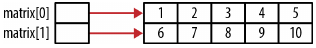
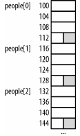

#  Les pointeurs
<!-- .slide: class="page-title" -->


## Sommaire
<!-- .slide: class="toc" -->

 *Comprendre enfin les pointeurs et savoir s'en servir. *

- Les pointeurs, une affaire et d'adresse et de valeur : taille, type, la pile et le tas.
- Step by Step : Allocation / Déréferencement / Assignation / Désallocation.
- Les pointeurs et les fonctions : entrés/sorties de fonctions et pointeurs de fonctions.
- Retour sur les tableaux : savoir jongler avec les adresses mémoires.
- Les chaînes de caractères et les pointeurs : des tableaux de caractères en passant par les opérations sur les chaines.
- Retour sur les structures : manipuler des pointeurs sur des structures et enfin un peu de listes chainées.


## Les pointeurs du point de vue théorique
<!-- .slide: class="toc" -->

*Les pointeurs OK mais pourquoi :*

- Créer un code rapide et efficace
- Fournir un moyen *pratique* pour traiter de nombreux types de problèmes
- Permettre une allocation dynamique de mémoire
- Utiliser des expressions compact et succinct
- Transmettre des structures de données sans surcharge
- Protéger les données transmises en tant que paramètre à une fonction


## Les pointeurs une affaire et d'adresse et de valeur : La mémoire de votre ordinateur
<!-- .slide: class="toc" -->

Quand un programme déclare une variable, le compilateur réserve un emplacement mémoire avec une adresse unique pour stocker cette variable.

Il associe l’adresse au nom de la variable.

Une variable de programme a une adresse de mémoire spécifique :

<pre>
 +--------+
 |        |
 |  1000  |
 |  1001  |
 |  1002 <---< rate = 100
 |  1003  |
 |  1004  |
 |        |
 +--------+
</pre>

Une variable appelée rate est déclarée et initialisée à 100.
Le compilateur a réservé un emplacement mémoire à l’adresse 1002, qu’il associe donc au nom de la variable.


### La mémoire entre la pile et le tas

|    Le processeur,              |   Les mémoires,                                                     |
| ------------------------------ | ------------------------------------------------------------------- |
|  qui réalise les calculs       |  qui contiennent les informations                                   |
|  et les opérations logiques ;  |  (programmes à exécuter, données à traiter, résultats des calculs). |

La pile est la zone de mémoire utilisée pour les variables locales.
Chaque variable disparaît automatiquement dès que vous quittez son bloc de porté.
Le tas arrive lorsque que l'on a besoin de maitriser la durée de vie d'une variable.

<pre>
 +------------------+
 |       STACK      | <- variable local
 +------------------+
 |       HEAP       | <- malloc
 +------------------+
 |       DATA       | <- globals / constants / static
 +------------------+
 |       CODE       |
 +------------------+
</pre>


## Quand faut-il utiliser le tas ?

+ Un gros bloc de mémoire (par exemple, un grand tableau ou une grande structure),
+ Conserver cette variable sur une longue période (comme un global)
+ Si vous avez besoin de variables comme des tableaux et des structures qui peuvent changer de taille dynamiquement (par exemple des tableaux qui peuvent croître ou rétrécir selon les besoins).

> Vue imagée du tas : une armoire de casiers dans un vestiaire.


## La déclaration d'un pointeur
<!-- .slide: class="toc" -->

*Les variables pointeurs sont déclarées en utilisant un type de données suivi d'un astérisque , puis le
le nom de la variable pointeur. *

Dans l'exemple suivant, un nombre entier et un pointeur vers un entier sont déclarés :

>int num;

>int *pi; // pi pointe sur une variable de type entier


## Utilisation d'un pointeur

    /* Exemple simple d’utilisation d’un pointeur. */
    #include <stdio.h>
    #include <stdlib.h>


    int main()
    {
        /* Déclaration et initialisation d’une variable int */
        int var = 1;
        /* Déclaration d’un pointeur vers une variable int */
        int *ptr;

        /* Initialisation de ptr  */
        ptr = &var;
        /* Accès direct et indirect à var */
        printf("Accès direct, var = %d\n", var);
        printf("Accès indirect, var = %d\n\n", *ptr);
        /* Affichage de l’adresse avec les deux méthodes */
        printf("L’adresse de var = %d\n", &var);
        printf("L’adresse de var = %d\n", ptr);
        exit(EXIT_FAILURE);
    }


## Les opérateurs unaires & et *

- L’opérateur d’adresse &:
    + retourne un pointeur, de type pointeur constant sur le type
    de l’opérande (pas une lvalue!)
    + permet d’affecter l’adresse d’un objet d’un certain type à un pointeur, ex:
> int *pe;

- L’opérateur de déréférenciation *:
    + retourne l’objet pointé par un pointeur
    + utilisation de la valeur, ex:
> int entier = *pentier;
    + utilisation de l’objet, ex:
> *pentier = entier;


## Initialisation d'un pointeur et point essentiel à retenir

- Le contenu de pi devrait finalement être attribué l'adresse d'une variable entière .
- Ces variables ont pas été initialisé et donc contenir des ordures .
- Il n'y a rien inhérent à la mise en œuvre d'un pointeur qui indique quel type de données, il fait référence ou si son contenu est valide.
- Cependant, le type de pointeur a été spécifié et le compilateur souvent complaine lorsque le pointeur est pas utilisé correctement.


## Le « pointeur sur rien »

- Symbole permettant de représenter un pointeur ne pointant sur rien: NULL (dans stddef.h, stdio.h, stdlib.h)
-  Peut être utilisé pour des comparaisons d’égalité et d’inégalité entre pointeurs, ex:
>       if (pointeur == NULL) { ...
>       if (pointeur != NULL) { ...
-  Recommandé pour initialiser les valeurs de pointeurs, ex:
>       int *pointeur = NULL;


## Les pointeurs génériques

Le type pointeur générique s’écrit void \* :

- il pointe vers n’importe quel type d’objet

- il interdit l’arithmétique sur pointeur et la déréférenciation déclaration similaire à celle des autres pointeurs possibilité de comparaisons d’égalité: le type void \* peut être comparé avec == et != avec n’importe quel autre type de pointeur

- possibilité de conversions par affectation: à la fois en affectant à un pointeur void \* un pointeur de type quelconque, et en affectant à un pointeur de type quelconque un pointeur de type void \*
    */!\ Il faut que cette dernière opération ait un sens (dangereux!)*


**/!\ Ne pas confondre ce void signifiant « n’importe quel objet » avec celui des prototypes de fonction signifiant « rien du tout ».**


## Salade de pointeurs fonctions
<br>
```c
    // pointeur sur la fonction foo ayant pour argument void et retournant void
    void (*fptr_foo)(); // attention différent de void *foo();
```

```c
    // Passed a double and returns an int
    int (*fptr_f1)(double);
```

```c
    // Passed a pointer to char and returns void
    void (*fptr_f2)(char*);
```

```c
    // Passed two integers and returns a pointer to a double
    double* (*fptr_f3)(int, int);
```

*Note : pour plus de clareté, il est souvent convenu de nommer les pointeurs de fonction avec le préfixe : "fptr_"*


## (pointeur de fonction) != (fonction retournant un pointeur)
<br>
```c
    int *f4(); // fonction retournant un pointeur de fonction retournant un entier
    int (*f5)(); // pointeur de fonction retournant un entier
    int *(*f6)(); // pointeur de fonction retournant un pointeur de fonction retournant un entier
```

La même chose en plus claire :

```c
    int* f4();
    int (*fptr_f5)();
    int* (*fptr_f6)();
```


## Utilisation des pointeurs de fonction
<br>
```c
    int (*fptr_1)(int);

    int square(int num) {
        return num*num;
    }
```

```c
    int n = 5;
    fptr_1 = &square;
    printf("%d squared is %d\n",n, fptr_1(n));
```


## typedef pointeur de fonction

*Il est usuel de décalarer une définition de types pour un  pointeur de fonction*

```c
    typedef int (*funcptr)(int);
```

```c
    funcptr fptr2;
    fptr2 = square;
    printf("%d squared is %d\n",n, fptr2(n));
```


## Passage de pointeur de fonction en paramètre de fonction
<br>
```c
    int add(int num1, int num2) {
        return num1 + num2;
    }

    int subtract(int num1, int num2) {
        return num1 - num2;
    }

    typedef int (*fptr_Operation)(int,int);

    int compute(fptr_Operation operation, int num1, int num2) {
        return operation(num1, num2);
    }

    printf("%d\n",compute(add,5,6));
    printf("%d\n",compute(sub,5,6));
```
> Les pointeurs de fonction permettent un code plus fléxible.


## Retourner un pointeur de fonction
<br>
```c
    fptr_Operation select(char opcode) {
        switch(opcode) {
            case '+':
                return add;
            case '-':
                return subtract;
        }
    }
```
```c
    int evaluate(char opcode, int num1, int num2) {
        fptr_Operation operation = select(opcode);
        return operation(num1, num2);
    }
```
```c
    printf("%d\n",evaluate('+', 5, 6));
    printf("%d\n",evaluate('-', 5, 6));
```


## Travailler avec un tableau de pointeurs

<br>
```c
    typedef int (*operation)(int, int);
    operation operations[128] = {NULL};
```

```c
    // la même chose sans typedef
    int (*operations[128])(int, int) = {NULL};
```


```c
    void initializeOperationsArray() {
        operations['+'] = add;
        operations['-'] = subtract;
    }
```
```c
    int evaluateArray(char opcode, int num1, int num2) {
        fptr_Operation operation;
        operation = operations[opcode]; // il faudrait vérifier que les pointeurs de fonctions ne sont pas nulles
        return operation(num1, num2);
    }
```

```c
    initializeOperationsArray();

    printf("%d\n",evaluateArray('+', 5, 6));
    printf("%d\n",evaluateArray('-', 5, 6));
```


## Comparaisons sur des pointeurs de fonctions

Des pointeurs de fonction peuvent être comparés l'un à l'autre utilisant les opérateurs d'inégalité et l'égalité.

```c
    fptrOperation fptr1 = add;
    if(fptr1 == add) {
        printf("fptr1 points to add function\n");
    } else {
        printf("fptr1 does not point to add function\n");
    }
```

TP

<!--Un exemple plus utile de comparaison pointeurs de fonction serait utilisation d'un tableau de pointeurs de fonction qui représenterait les étapes d'une tâche.

Un ensemble d'opérations trier, calculer une quantités et afficher.
Un deuxième ensemble d'opérations afficher, trouver le plus cher/le moins cher et afficher ensuite leur différence.
Chaque opération pourrait être définie par un tableau d'indicateurs sur les fonctions individuelles.
Une opération de rondin(journal) peut assister dans les deux listes.
La capacité de comparer deux indicateurs de fonction permettrait la modification dynamique d'une opération en supprimant l'opération,
comme l'enregistrement(l'exploitation des bois),
en trouvant et enlevant ensuite la fonction de la liste.-->


## Caster un pointeur de fonction

<br>
```c
    typedef int (*fptr_SingleInt)(int);
    typedef int (*fptr_TwoInts)(int,int);

    int add(int, int);

    fptr_TwoInts fptr_First = add;
    fptr_SingleInt fptr_Second = (fptr_SingleInt)fptr_First;

    fptr_First = (fptr_TwoInts)fptr_Second;

    printf("%d\n",fptr_First(5,6));
```

<!--This sequence, when executed, will display 11 as its output.
Conversion between function pointers and pointers to data is not guaranteed to work.
The use of void* is not guaranteed to work with function pointers.
That is, we should not assign a function pointer to void* as shown below:

```c
    void* pv = add;
```

However, when interchanging function pointers, it is common to see a “base” function  pointer type as declared below.
This declares fptr_Base as a function pointer to a function, which is passed void and returns void:
```c
    typedef void (*fptr_Base)();
```

The following sequence demonstrate the use of this base pointer, which duplicates the previous example:
```c
    fptr_Base basePointer;
    fptr_First = add;
    basePointer = (fptr_ToSingleInt)fptr_First;
    fptr_First = (fptr_ToTwoInts)basePointer;
    printf("%d\n",fptr_First(5,6));
```

A base pointer is used as a placeholder to exchange function pointer values.
Always make sure you use the correct argument list for function pointers.
Failure to do so will result in indeterminate behavior.

## Summary
Understanding the program stack and heap structures contributes to a more detailed and thorough understanding of how a program works and how pointers behave.
In this chapter, we examined the stack, the heap, and the stack frame.
These concepts help explain the mechanics of passing and returning pointers to and from a function.
For example, returning a pointer to a local variable is bad because the memory allocated to the local variable will be overwritten by subsequent function calls.
Passing a pointer to constant data is efficient and prevents the function from modifying the data passed.
Passing a pointer to a pointer allows the argument pointer to be reassigned to a different location in memory.
The stack and heap helped detail and illustrate this functionality.
Function pointers were also introduced and explained. This type of pointer is useful for controlling the execution sequence within an application by allowing alternate functions to be executed based on the application’s needs.-->


## Pointeurs et tableaux

- Pour effectuer de manière efficace des traitemant sur les tableaux utilisons les pointeurs
- Attention : ne pas confondre pointeur et tableau.
- Problématique : utlisation de Malloc/Realloc, allocation dynamique pouur les tableaux multidimentionnelles
- Les tableaux de tableaux (escalier)

```c
    int vector[5] = {1, 2, 3, 4, 5};
    printf("Nombre d'éléments = %d\n", sizeof(vector)/sizeof(int));
```


## Rappels sur les tableaux multidimentionnelles
<br>
```c
    int matrix[2][3] = {{1,2,3},{4,5,6}};

    for (int i = 0; i < 2; i++) {
        printf("&matrix[%d]: %p sizeof(matrix[%d]): %d\n", i, &matrix[i], i, sizeof(matrix[i]));
    }
```

```c
    // The elements are allocated contiguously i int
    arr3d[3][2][4] = {
        {{1, 2, 3, 4}, {5, 6, 7, 8}},
        {{9, 10, 11, 12}, {13, 14, 15, 16}},
        {{17, 18, 19, 20}, {21, 22, 23, 24}}
    };
```


##  La notation pointeur et les tableaux

*Il est possible d'affecter l'adresse d'un tableau à un pointeur*

```c
    int vector[5] = {1, 2, 3, 4, 5};
    int *pv = vector;
```

- La variable pv est un pointeur sur le premier élément du tableau

*- /!\ ce n'est pas le tableau lui-même.*

- les deux lignes suivantes sont équivalentes :
```c
    printf("%p\n",vector);
    printf("%p\n",&vector[0]); // plus explicites
```

- la ligne suivante est différente :
```c
    &vector
```

- Ici on pointe sur tous le tableau d'entier, .
- Alors que précédemment on travaillait sur un seule entier


## arithmétique de pointeur et tableau

- les deux lignes suivantes sont équivalentes :
```c
    pv[i];
    *(pv + i);
```
- pv : pointe sur un bloc mémoire
- Avec les parenthèses : on se positionne ième bloc mémoire
- \* nous permet de déférencé le pointeur obtenu

- les deux lignes suivantes sont équivalentes :
```c
    *(pv + i)
    *(vector + i)
```

- Quand nous ajoutons 1 à l'adresse du tableau nous déplaçons de la taille du type d'un élément, ici 4 (taille d'un entier).
- /!\ Il faut faire attention à ne pas dépasser les limites du tableau.


## Differences entre tableaux et pointeurs

<br>
```c
    int vector[5] = {1, 2, 3, 4, 5};
    int *pv = vector;
```

- le code machine produit par vector[i] et différent du code produit par vector+i.
- vector[i] génère un code qui part de la position vector, on se déplace de i emplacements et on utilise le contenus.
- vector+i génère un code qui part de la position vector, ajoute i a l'adresse et ensuite utilise le contenu de cette adresse.

- Ces quasi pareil, mais les soucis commence si on travail mal avec sizeof

- Appliquer l'opérateur sizeof à vector retournera 20 = 4 octets \* 5 emplacements.
- Appliquer l'opérateur sizeof à pv retournera 4, la taille du pointeur.

- Deuxième différence : pv est une `lvalue`, il peut donc être modifié (il peut pointer une nouvelle adresse).
- vector n'est pas une ̀ lvalue`, donc non modifiable, on ne peut changer sont adresse.

```c
    pv = pv + 1;
    vector = vector + 1; // Syntax error
    pv = vector + 1;
```

- /!\ vector est un contenu


## Créer des tableaux avec Malloc

- Théorie : si on alloue de la mémoire sur le "tas" et qu'on l'assigne à un pointeur on devrait pouvoir l'utiliser comme un tableau.

```c
    int *pv = (int*) malloc(5 * sizeof(int));
    for(int i=0; i<5; i++) {
        pv[i] = i+1;
    }
```

```c
    for(int i=0; i<5; i++) {
        *(pv+i) = i+1;
    }
```
- /!\ attention a chaque malloc sont free.


<!--
*Utiliser realloc pour redimmensionner un tableau*
*Passer un tableau une dimension*
*- Notation tableau*
*- Notation Pointeur*
*Utilisation une dimansion de pointeur*
-->


## Pointeurs et tableaux multidimmensionnelles

<br>
```c
    int matrix[2][5] = {{1,2,3,4,5},{6,7,8,9,10}};
```

```c
    for(int i=0; i<2; i++) {
        for(int j=0; j<5; j++) {
            printf("matrix[%d][%d] Address: %p Value: %d\n", i, j, &matrix[i][j], matrix[i][j]);
        }
    }
```

```c
    int (*pmatrix)[5] = matrix;
```




<!--*Passer un tableau multi-dimensions*-->


## Allocation dynamique de tableau de pointeurs 2-dimensions
- allocation potentiellement non continue en mémoire
```c
    int rows = 2;
    int columns = 5;
    int **matrix = (int **) malloc(rows * sizeof(int *));
    for (int i = 0; i < rows; i++) {
        matrix[i] = (int *) malloc(columns * sizeof(int));
    }
```
- /!\ 2 malloc donc pas on ne garantie pas une allocation continue en mémoire !

- allocation continue en mémoire
```c
    int matrix[2][5] = {{1,2,3,4,5},{6,7,8,9,10}};
```
- continue en mémoire mais pas dynamique

- la solution un seul malloc :

```c
    int *matrix = (int *)malloc(rows * columns * sizeof(int));
```


<!--*tableau de pointeurs 2-dimensions en escalier*-->


## Pointeurs et chaînes de caractères (strings)

- Les pointeurs vers un "char" permetent :
    + pour les allocations dynamiques de chaines de charactères
    + et pour les entrés/sorties de fonctions

- Les strings peuvent être pointées par un char ou un const char :
    + char : modifiable
    + const char non modifiable mais pas besoin de passer sa taille lors d'un passage vers une fonction.


##  String : les Fondamentaux

- Une string est une séquence de caractères se terminant pas l'ascii NUL représenté par '\0'.
- /!\ un tableau de caractères n'est pas néécessairement une string
    - un tableau de caractères peut ne pas contenir le caratère NUL.
    - un tableau de caractères peut être utilis" pour stcoker de peut entier pour gagner de la place.


## string.h

- Il y a 2 types de strings en C:
    + Byte string : soit une séquence de char (un octet)
    + Wide string : soit une séquence de wchar_t (2 ou 4 octets)(pour les langues non latines).
- La longueur d'une string et définit par le nombre de caractères sans compter '\O'

- /!\ lorsque l'allocation mémoire est manuelle ne pas oublier de faire de la place pour '\0'
- /!\  NULL != NUL
    + NULL = ((void*)0)
    + NUL = '\0'.


## Initialisation de String (point de vue tableau de c)

- initialiser un tableau de caractères
        +  en utilisant l'opérateur d'initialisation :
```c
    char header[] = "Media Player";
    printf("%d\n",sizeof(header)); // -> 13 : 12 + '\0'
```
        + en utilisant strcpy :
```c
    char header[13];
    strcpy(header,"Media Player");
```
     + la version courageuse :
```c
    header[0] = 'M';
    header[1] = 'e';
    // ...
    header[12] = '\0';
```


##  Initialisation de String (point de vue pointeur vers un char)

- Pointeur vers un char
```c
    char *header;
```
- Allocation dynamique et strcpy
```c
    char *header = (char*) malloc(strlen("Media Player")+1);
    strcpy(header,"Media Player");
```
Note : *- /!\ ne pas oublier '\0'*
       *- ne pas utiliser sizeof mais strlen (sizeof va nous retourner la taille du pointeur)'*

     + la version courageuse :
```c
    char* header  = (char*)malloc(13);
    *(header + 0) = 'M';
    *(header + 1) = 'e';
    // ...
    *(header + 12) = '\0';
```

```c
    char* prefix = '+'; // ERREUR !!!

    // faire  :
    prefix = (char*)malloc(2);
    *prefix = '+';
    *(prefix+1) = 0;
```


##  Pointeurs et structures

Les pointeurs peuvent permettre de lier des éléments entre-eux ( noeuds, listes chainées, arbres  ... )

Soit la structure suivante :
```c
    typedef struct _person {
        char* name;
        unsigned int age;
    } Person;
```

Une instance de personne peut se déclarer ainsi :
```c
    Person person;
    person.name = (char*)malloc(strlen("Emily")+1);
    strcpy(person.name,"Emily");
    person.age = 23;
```


##  Allocation mémoire
Il est aussi possible de déclarer un pointeur et d'allouer l'espace mémoire ainsi :
```c
    Person *ptrPerson;
    ptrPerson = (Person*)malloc(sizeof(Person));
    ptrPerson->name = (char*)malloc(strlen("Emily")+1);
    strcpy(ptrPerson->name,"Emily");
    ptrPerson->age = 23;
```

Une autre méthode consiste à déréférencer le pointeur en premier puis appliquer l'opérateur '.'
```c
    (*ptrPerson).name = (char*)malloc(strlen("Emily")+1);
    strcpy((*ptrPerson).name,"Emily");
    (*ptrPerson).age = 23;
```


##  Allocation mémoire et padding

*Pour des raison de performances, au niveau du bus de données le processeur cherche à lire en seule cycle un ensemble d'adresse mémoire.*

*Les contraintes d'alignement en mémoire dépendent de l'architecture du processeur.*

- La taille mémoire d'une structure est au minimum égal à la somme de  :
    + la taille de chacun de ses champs,
    + plus les bits d'alignements.

> Un short est typiquement aligné sur une adresse paire.
> Un entier est aligné sur une adresse divisible par quatre.

- /!\ Attention :
    + L'arithmétique de pointeur doit être utilisée avec le soin
    + Les tableaux de structures peuvent avoir des bits de bourrage entre leurs éléments


##  Padding et tableau de structures

<br>
```c
    typedef struct _alternatePerson {
        char* firstName;
        char* lastName;
        char* title;
        short age;
    } AlternatePerson;

    AlternatePerson otherPerson;
    printf("%d\n",sizeof(AlternatePerson)); // Affiche : 16

    AlternatePerson people[30];
```



[Lien vers alignement et padding dans le détails](http://www.catb.org/esr/structure-packing/)


##  Les listes chainées

- Les pointeurs permettent une grande flexibilité pour créer et utiliser des ensembles de noeuds de données (liste chainée, file, pile, arbre, ...) :
    + attribution dynamique de mémoire,
    + la mémoire ne doit pas être contiguë, contrairement aux tableaux.
    + ajout, suppression, modifications de l'ordre des éléments, beaucoup plus simple que pour les tableaux

- Principe :
    + définir dans l'élément un champ 'pointeur sur le suivant' qui contient l'adresse de l'élément suivant.
    + connaître le début de la liste pour la parcourir séquentiellement en allant chercher l'élément suivant,
    + le dernier noeud pointe sur NULL (fin de liste).


##  Exemple 1/2

<br>
```c
    typedef struct _node {
        void *data;
        struct _node *next;
    } Node;

    typedef struct _linkedList {
        Node *head;
        Node *tail;
        Node *current;
    } LinkedList;
```


##  Exemple 2/2

<br>
```c
    void initializeList(LinkedList*)
    void addHead(LinkedList*, void*)
    void addTail(LinkedList*, void*)
    void delete(LinkedList*, Node*)
    Node *getNode(LinkedList*, COMPARE, void*)
    void displayLinkedList(LinkedList*, DISPLAY)
```

> *TP 4*


##  Correction initializeList

<br>
```c
    void initializeList(LinkedList *list) {
        list->head = NULL;
        list->tail = NULL;
        list->current = NULL;
    }
```


##  Correction addHead

<br>
```c
    void addHead(LinkedList *list, void* data) {
        Node *node = (Node*) malloc(sizeof(Node));
        node->data = data;
        if (list->head == NULL) {
            list->tail = node;
            node->next = NULL;
        } else {
            node->next = list->head;
        }
        list->head = node;
    }
```


##  Correction addTail

<br>
```c
    void addTail(LinkedList *list, void* data) {
        Node *node = (Node*) malloc(sizeof(Node));
        node->data = data;
        node->next = NULL;
        if (list->head == NULL) {
            list->head = node;
        } else {
            list->tail->next = node;
        }
        list->tail = node;
    }
```


##  Correction getNode

<br>
```c
    Node *getNode(LinkedList *list, COMPARE compare , void* data) {
        Node *node = list->head;
        while (node != NULL) {
            if (compare(node->data, data) == 0) {
                return node;
            }
            node = node->next;
        }
        return NULL;
    }
```


##  Correction delete

<br>
```c
    void delete(LinkedList *list, Node *node) {
        if (node == list->head) {
            if (list->head->next == NULL) {
                list->head = list->tail = NULL;
            } else {
                list->head = list->head->next;
            }
        }else{
            Node *tmp = list->head;
            while (tmp != NULL && tmp->next != node) {
                tmp = tmp->next;
            }
            if (tmp != NULL) {
                tmp->next = node->next;
            }
        }
        free(node);
    }
```


##  Correction displayLinkedList

<br>
```c
    void displayLinkedList(LinkedList *list, DISPLAY display) {
    printf("\nLinked List\n");
    Node *current = list->head;
        while (current != NULL) {
            display(current->data);
            current = current->next;
        }
    }
```


##  Correction main

<br>
```c
    void main(void) {
        LinkedList linkedList;

        Employee *samuel = (Employee*) malloc(sizeof(Employee));
        strcpy(samuel->name, "Samuel"); samuel->age = 32;

        Employee *sally = (Employee*) malloc(sizeof(Employee));
        strcpy(sally->name, "Sally"); samuel->age = 32;

        initializeList(&linkedList);
        addHead(&linkedList,samuel);
        addTail(&linkedList,sally);

        Node *node = getNode(&linkedList,(int (*)(void*, void*))compareEmployee, sally);
        delete(&linkedList, node);

        displayLinkedList(&linkedList, (DISPLAY)displayEmployee);
    }

```


<!--

## Program Stack
The program stack is an area of memory that supports the execution of functions and is normally shared with the heap.
That is, they share the same region of memory.
The program stack tends to occupy the lower part of this region, while the heap uses the upper part.
The program stack holds stack frames, sometimes called activation records or activation frames.
Stack frames hold the parameters and local variables of a function. The heap manages dynamic memory and is discussed in “Dynamic Memory Allocation” on page

Figure 3-1 illustrates how the stack and heap are organized conceptually. This illustra‐
tion is based on the following code sequence:
void function2() {
Object *var1 = ...;
int var2;
printf("Program Stack Example\n");
}
void function1() {
Object *var3 = ...;
function2();
}
int main() {
int var4;
function1();
}
As functions are called, their stack frames are pushed onto the stack and the stack grows
“upward.” When a function terminates, its stack frame is popped off the program stack.
The memory used by the stack frame is not cleared and may eventually be overridden
by another stack frame when it is pushed onto the program stack.

-->


